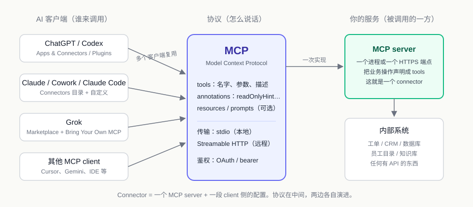

# 01 Connector 是什么，为什么大家都在用它

> 本章不写代码。目的是把"Connector"这个词从产品按钮还原成一个可以自己动手做的东西，并说明本教程后面五章要做什么。

## 1. 那个叫 Connectors 的按钮

打开 2026 年的任何一个主流 AI 客户端，设置里都有一页长得差不多的东西：一排 Gmail、Google Drive、Notion、GitHub、Slack 的图标，每个后面一个"Add"或"Install"。名字不太一样，Claude 叫 Connectors，OpenAI 这边叫 Apps & Connectors，在 Codex 应用里显示为 Plugins，Grok 叫 Marketplace 里的 Plugins。

三张图并排看，会发现两件事。

第一，**列表高度重合**。Gmail、Calendar、Drive、Notion、Slack 在三家都排在前面。不是三家各自跟 Google 谈了三次合作，而是这些服务只做了一次接入，三家客户端都能用。

第二，**每家都留了一个"自定义"入口**。Claude 的页面上方有 "Your custom connectors"，Grok 的新建 connector 里有 "Custom"，OpenAI 在开发者模式下可以粘一个 server URL。这个入口的存在说明，列表里那些官方图标和你自己接的东西，走的是同一条路。

这条路叫 MCP，Model Context Protocol。Anthropic 2024 年 11 月发布，OpenAI 2025 年 10 月的 DevDay 上宣布采纳，xAI 2026 年 5 月 6 日给 Grok 上 Connectors 的同一天就带了 "Bring Your Own MCP"。到今天，Claude、ChatGPT、Gemini、Grok 四家都有 MCP client。

## 2. 为什么都走这条路

站在三个位置上想一遍，答案是同一个。

**做 AI 客户端的人。** 用户要的集成是无穷的：邮件、日历、文档、代码仓库、CRM、工单、公司内部那套没人听说过的系统。不可能每个都自己写。需要一个口子，让服务提供方自己接进来，客户端只管调用。

**用 AI 客户端的人。** 数据在自己的系统里。以前的用法是复制一段粘进对话框，AI 回答，再复制回去。connector 让 AI 直接读那个系统，用户只说要什么。

**提供服务的人。** 如果每家 AI 客户端有一套私有格式，接四家就要写四遍。有一个共同协议，写一次，四家都能装。

三方的需求恰好指向同一个东西：一个开放的、与客户端无关的工具描述与调用协议。

上一代方案卡在哪里可以对照看。2023 年 ChatGPT Plugins 用的是 OpenAPI 描述加一个 manifest，只有 ChatGPT 一个客户端能装，服务方为一家写一份，动力不足；各家的 function calling 格式互不兼容，模型换了集成就要重写。MCP 解决的是"谁来定格式"的问题：不由任何一家客户端定，而是一个所有客户端都实现的协议。

## 3. Connector 拆开是什么

去掉产品包装，一个 connector 就是两样东西：**一个 MCP server，加一段 client 侧的配置**。

MCP server 做三件事：

1. **声明 tools**。每个 tool 有名字、参数 schema、一段自然语言 description。模型读 description 决定什么时候调用、传什么参数。
2. **执行调用并返回结果**。结果是结构化数据，模型拿去继续推理。
3. **可选地标注**。比如 `readOnlyHint` 告诉客户端这个 tool 不改数据，客户端可以据此决定是否需要用户确认。

传输层有两种。**stdio** 是客户端把 server 当子进程拉起来，走标准输入输出，只能本地用。**Streamable HTTP** 是 server 监听一个 URL，客户端发 HTTP 请求，可以远程。线上产品只接受后者，而且要 HTTPS。

client 侧的配置就是告诉客户端"这个 server 在哪"。Claude Code 是一个 `.mcp.json`，Codex 是 `config.toml` 里一段 `[mcp_servers.xxx]`，ChatGPT、Claude.ai、Grok 是设置页里粘一个 URL。同一家的客户端共用一套：ChatGPT 里加的 connector 在 Codex 里也能看到，Claude.ai 里加的在 Cowork 与 Desktop 里也在。

所以那排图标背后每一个都是一个 MCP server，通常由服务方自己托管。你在 Claude 里点 "Add" 和粘一个自定义 URL，客户端做的事完全相同。区别只是官方目录里的经过了审核。

## 4. 把自己的服务做成 connector

如果你有一个内部系统想让 AI 用上，要做的事按顺序是这五件。

**选传输。** 自己用、在本机跑，stdio 或本地 HTTP 都行。要给别人装、要上线上客户端，必须是公网可达的 HTTPS 端点。这一步决定了后面所有部署和鉴权的形态。

**把业务操作定义成 tools。** 不是把 REST API 一比一搬过来。一个好的 tool 对应用户会说的一句话："查这张工单""这个人的上级是谁"。参数少、返回结构化、一个 tool 只做一件事。

**写 description。** 这是模型唯一能看到的东西。写清什么时候用、参数怎么填、返回什么、有什么限制。description 写得含糊，模型就会在不该调的时候调、该调的时候不调。

**标读写。** 只查不改的 tool 标 `readOnlyHint`。会改数据的 tool 让返回值带上变更前后的状态，方便客户端或上层流程展示给人确认。这一条在第 03 章和第 06 章会反复出现。

**加鉴权。** 线上必须有。MCP 规范推荐 OAuth，简单场景 bearer token 也行。本教程的演示服务跑在本机，这一步略过，但会在第 06 章说清楚上线时要补什么。

做完这五件，各家客户端的接入方式：

| 客户端 | 怎么接自定义 connector | 限制 |
|---|---|---|
| Claude.ai / Cowork / Desktop | Customize → Connectors → 添加自定义 connector，粘 URL | 远程 HTTPS |
| Claude Code | 项目或用户级 `.mcp.json`，或 plugin 自带 | 本地 stdio、本地 HTTP、远程都可 |
| ChatGPT / Codex | ChatGPT：Settings → Apps & Connectors → Advanced → Developer mode 后新建，粘 URL；Codex：`codex mcp add` 或 `~/.codex/config.toml` | ChatGPT 远程 HTTPS，需 Plus / Pro 或企业管理员开放；Codex 本地与远程都可 |
| Grok | grok.com/connectors → New Connector → Custom，粘 URL | 远程 HTTPS |

注意最后一列。**线上聊天类客户端只接受公网 HTTPS，本机跑的服务只有 Claude Code、Codex CLI 这类本地客户端能直接连。** 这就是本教程选 Claude Code 做演示的原因：三个模拟系统在本机起，不用申请域名和证书，读者十分钟能跑起来。同样的 server 加上 HTTPS 和鉴权，就能接到 Cowork 或 ChatGPT 上，协议层不用改。

## 5. 一个成体系的案例：Claude for Financial Advisors

Anthropic 2026 年 9 月发布的 Claude for Financial Advisors 是一个用 connector 搭起来的完整产品。场景是理财顾问开客户会议前的准备：CRM 里的客户记录、组合管理系统里的持仓与绩效、税务与遗产规划工具里的状态、上次会议的记录、最近的邮件往来，要在会前拼成一页纸。

这些数据分别在 Salesforce、Orion、Wealth.com、Zocks、Gmail 之类的系统里。以前顾问自己开五个窗口拼；这个产品让顾问说一句"帮我准备明天和某某家的会"。

打开它的开源仓库 anthropics/financial-services，结构很清楚：

- `.mcp.json` 里列了二十多个 MCP 地址：Orion、Wealthbox、Addepar、Envestnet Tamarac、Wealth.com、Zocks、MoneyGuide 这些行业系统，加上 Gmail、Google Calendar、Microsoft 365、Box、Slack、Zoom 这些通用工具，每个都是 `type: http` 加一个 URL。**这是 connector 层**，数据从这里进来。
- `skills/*/SKILL.md` 里是八个 skill：pre-meeting、post-meeting、prospect-intake、onboarding、compliance 等，每个写的是顾问的工作流程：会前准备要查哪些系统、按什么顺序、哪些数字必须交叉核对、出现冲突怎么办。**这是 skill 层**，把专家的做法写成文字，让模型照着做。
- `plugin.json` 加一个 marketplace 清单，把上面两样打成一个可安装、可版本更新的包。**这是 plugin 层**。

三层缺一个都不成产品。只有 connector，用户拿到一堆 tool 不知道怎么组合。只有 skill 没有 connector，流程写得再好也没有数据。有了前两样不打包，每个用户要手工配十来个 URL、复制一堆 Markdown 文件，没人会用。

换句话说，connector 解决的是"接进来"，接进来之后还要有人写流程、有人打包。这也是本教程后面五章的结构。

## 6. 本教程要做什么

鬼哥用一个可以跑起来的项目把这三层各做一遍。场景换成 IT / HR 内部服务台，因为它足够常见，读者不需要金融背景就能判断 AI 做得对不对。

一线服务台人员面对三个互不相通的系统：工单、员工目录、知识库。本教程：

- 用 Python + FastMCP 写三个模拟系统，每个是一个 MCP server，共 12 个 tool，一条命令全部启动。这是 **connector**。
- 写四个 skill：工单分诊、新员工入职准备、FAQ 回复、周报。这是 **skill**。
- 打成两个 plugin：一个是能力集合，一个是端到端的 agent。这是 **plugin**。

跑通的标志是一句话：在 Claude Code 里说"帮我处理 T-1042"，Claude 查工单、查提单人、查知识库、判断根因、拟好回复和状态变更，停下来等人确认，确认后写回。

六章安排：

| 章 | 内容 |
|---|---|
| 01 | 本章。Connector 是什么，为什么大家都在用 |
| 02 | 用户视角走一遍：装 plugin、接系统、说一句话、拿到成品 |
| 03 | Connector 层：用 FastMCP 把三个内部系统喂给 Claude |
| 04 | Skill 层：SKILL.md、触发词、command、references 的分工 |
| 05 | Plugin 层：plugin.json、marketplace、版本更新，agent plugin 与 vertical plugin 的区别 |
| 06 | 产品化检查清单：不可信内容边界、读写分离、发布流程、如何换成自己的行业 |

代码在本仓库，跑起来的步骤见 [00 试用指南](00-quickstart.md)。想先看结果再看原理，直接进 [02 章](02-user-walkthrough.md)。

---

**参考**

- Anthropic，Introducing the Model Context Protocol，2024-11
- OpenAI Help Center，Developer mode and MCP apps in ChatGPT
- Claude Help Center，Get started with custom connectors using remote MCP；Claude Docs，Connectors directory
- xAI Docs，Grok Connectors；Grok Connectors 上线报道，2026-05-06
- OpenAI Codex Docs，MCP servers
- Anthropic，Claude for Financial Advisors；GitHub anthropics/financial-services
