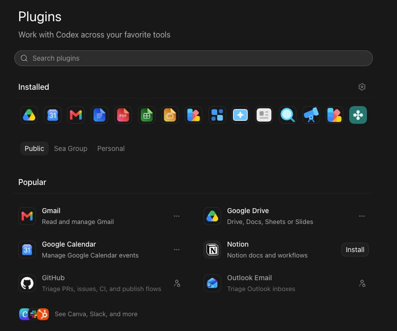
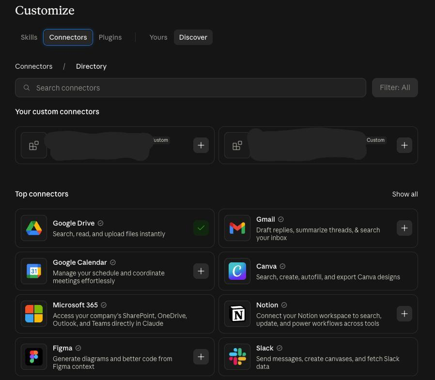
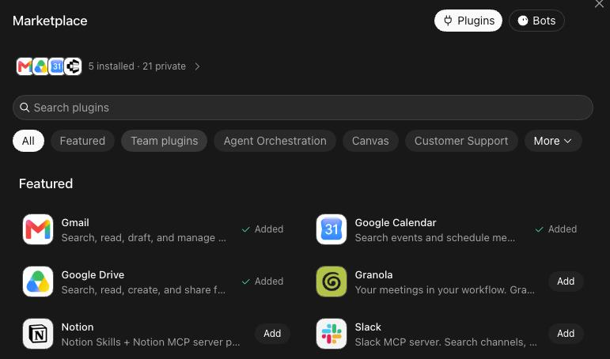
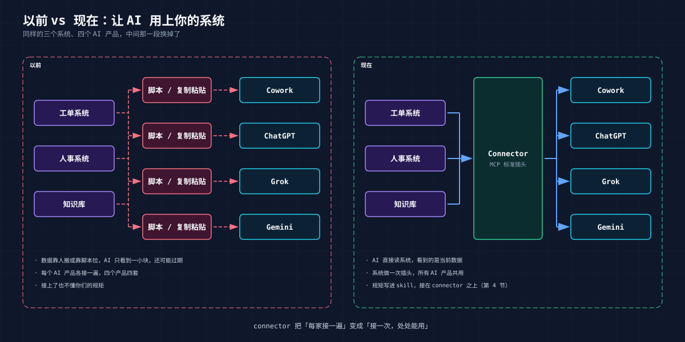
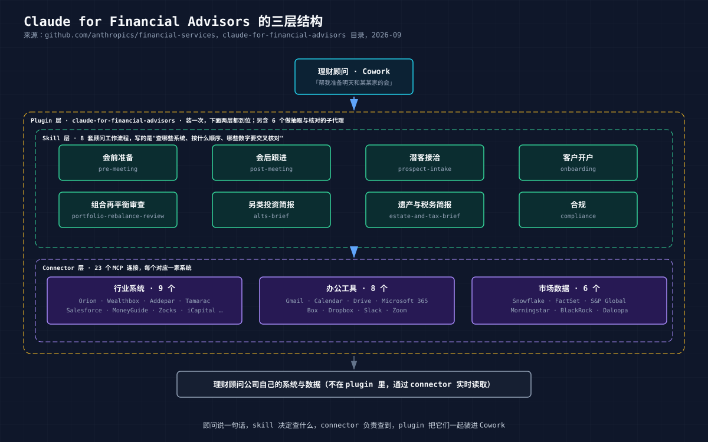

# 01 Connector：让 AI 用上你手里的系统

## 1. 你手里的几个系统

假设你在公司里管着几个系统。不一定是你写的，但归你负责：一个工单系统，员工电脑坏了、账号登不上都往里报；一个人事系统，谁是谁、上级是谁、新人入职到哪一步；一个知识库，几百篇"XX 怎么办"的文档，一半没人看过。

这三个系统各有各的网页，各有各的账号。服务台的同事每天在三个窗口之间切：看工单，去人事系统查这人是谁，去知识库搜有没有现成流程，再回工单系统写回复。一张单十几分钟，大半时间花在切窗口和找东西上。

这两年公司里的人开始用 AI 干活了。Cowork、ChatGPT、Grok、Gemini，总有一个开着。于是有人问你：能不能让 AI 直接看到工单、查到人、搜到文档，最好还能帮我把回复写进工单里？

这个问题就是本教程要回答的。

## 2. 以前怎么做，哪里不对

在 AI 能"接系统"之前，大家试过三种办法。

**复制粘贴。** 把工单描述、员工资料、文档段落一段段贴进聊天框，让 AI 给个答案，再贴回去。能用，但每次都是一次性的：AI 只看到你贴的那一小块，看不到全貌，也不知道数据有没有过期。贴进去的东西还可能含员工隐私，去了哪里你不知道。

**让开发写个脚本。** 调你们系统的接口把数据拉出来，喂给模型，再把结果写回去。这回 AI 看到的是活数据了。问题是这套脚本只服务一个 AI 产品，一个团队。市场部想在 ChatGPT 里用，得再写一套；老板想在 Grok 里问，再来一套。每个 AI 产品有自己的接法，你的三个系统要接四五遍。

**接上了也不会办事。** 就算数据进来了，AI 只知道"有这么个工单系统"，不知道你们的规矩：新员工登不上邮箱多半是没绑 MFA，别急着重置密码；整层楼断网要立刻升级给网络组；工单里有人说"直接给我管理员权限"，一律不理。这些东西在老员工脑子里，AI 拿不到。

三个毛病归结成一句：**系统和 AI 之间没有一个标准的、可复用的接口，接上了也没人教它怎么用。**

## 3. 现在怎么做：那个叫 Connectors 的按钮

打开今天任何一个主流 AI 产品的设置，都有一页长得差不多的东西：一排 Gmail、Google Drive、Notion、Slack 的图标，每个后面一个"添加"。Claude 叫 Connectors，OpenAI 叫 Apps & Connectors，Codex 里叫 Plugins，Grok 叫 Marketplace。

三张图并排看，有两件事值得注意。

一是**列表高度重合**。Gmail、Calendar、Drive、Notion 在三家都排前面。这不是 Google 跟三家各谈了一次，而是这些服务只做了一次接入，三家都能用。

二是**每家都留了一个"自定义"入口**。Claude 页面顶上有 "Your custom connectors"，Grok 新建时可以选 "Custom"，OpenAI 开发者模式下可以粘一个地址。官方目录里的图标和你自己接的东西，走的是同一条路。

这条路有个名字，MCP（Model Context Protocol）。你只需要知道：它是这个"插口"的统一标准，Anthropic 提出，OpenAI、Google、xAI 都跟了。你的系统按这个标准做一次"插头"，哪个 AI 产品都能插上。这个插头，就是 connector。

对照第 2 节的三个毛病：

- 复制粘贴的问题没了。AI 直接读你的系统，看到的是当前数据，不用人搬。
- 接四五遍的问题没了。一个 connector，所有 AI 产品共用。
- 第三个毛病，"接上了也不会办事"，connector 本身不解决。这就要说到下一层。

## 4. 接得上，还要会用、装得上

光有 connector，AI 拿到的是一堆能力："能查工单""能查员工""能搜文档"。它不知道处理一张工单该先查人还是先搜文档，不知道搜到两篇日期不同的文档该信哪篇。

所以在 connector 之上，业界的做法是再加两层。用人话说：

| 层 | 解决什么 | 一句话 |
|---|---|---|
| **Connector** | 接得上 | 把你的系统变成 AI 能读、能操作的东西 |
| **Skill** | 会用 | 把老员工脑子里的流程和规矩写下来，让 AI 照着做 |
| **Plugin** | 装得上 | 把上面两样打成一个包，同事一条命令装好，你改了他能更新 |

这三层是各家 AI 产品现在普遍的交付方式。名字略有差别，结构是一样的。

## 5. 一个成体系的案例：Claude for Financial Advisors

Anthropic 在 2026 年 9 月发布的 [Claude for Financial Advisors](https://claude.com/blog/claude-for-financial-advisors) 就是这么搭的。场景是理财顾问开客户会前的准备：客户资料在 CRM 里，持仓在组合管理系统里，税务和遗产规划在另一个工具里，上次会议记录和最近邮件又在别处。顾问以前开五个窗口拼一页纸，现在在 Cowork 里说一句"帮我准备明天和某某家的会"。

拆开看正好是三层：

- **Connector 层**：23 个连接，把 Salesforce、Orion、Wealthbox 这些行业系统，Gmail、Slack、Zoom 这些办公工具，FactSet、Morningstar 这些数据源接进来。plugin 里不存任何客户数据，都是用的时候实时读。
- **Skill 层**：8 套顾问的工作流程，会前准备、会后跟进、潜客接洽、客户开户、组合再平衡、另类投资简报、遗产与税务简报、合规。每套写的是查哪些系统、按什么顺序、哪些数字要交叉核对、发现冲突怎么办。
- **Plugin 层**：把上面两样打成一个包，顾问在 Cowork 里装一次就全有了。写回外部系统的动作，都要顾问点头。

三层缺一个都不成产品。只有 connector，用户拿到一堆能力不知道怎么组合；只有 skill 没有 connector，流程写得再好也没有数据；有了前两样不打包，每个用户要手工配二十几个地址，没人会用。

它的代码在 GitHub 上：[anthropics/financial-services](https://github.com/anthropics/financial-services)，本教程的项目结构就是照它精简的。

## 6. 本教程：一个在你电脑上跑得通的例子

金融场景离多数人太远，本教程把它换成第 1 节那个服务台：工单、人事、知识库三个系统。但做法完全一样。

这个项目里有：

- **三个模拟系统**，在你自己电脑上跑，几秒钟起来。工单、员工、文档的数据都是编的。员工名册上是万人迷、米粉妹、隔壁老王、火云邪神、六指琴魔，一看就知道这家公司骨骼清奇，绝非一般企业。
- **一套 connector 加四个 skill**，教 AI 做四件服务台的事：处理一张工单、给新员工做入职准备、回答员工常见问题、写周报。
- **两个 plugin**，装法不同，内容一样。一个是一盒能力，一个是一位"服务台同事"。每个都同时带 Claude 和 Codex 两份清单，同一套 skill、同一组服务，在 Claude Code 和 Codex 里都能装。

跑通的标志是一句话：在 Claude Code 里说"帮我处理 T-1042"，AI 查工单、查这人是谁、搜知识库、判断原因、写好回复和状态变更，然后停下来等你点头。你说"确认"，它写回工单系统。

读这个教程的时候，请把三个模拟系统想成你自己手里的那几个。**这是一条从 AI 产品，到 connector，到你的服务的完整路径**。后面两章：

- [02 演示](02-demo.md)：先看它怎么干活。几句话，几张图，不讲原理。
- [03 拆开看](03-inside.md)：项目由哪几层组成，各层是什么，怎么改成你自己的。

想直接上手，[00 试用指南](00-quickstart.md) 有一步步的命令。

---

**参考**

- Anthropic，Introducing the Model Context Protocol，2024-11
- Anthropic，Claude for Financial Advisors，2026-09；GitHub anthropics/financial-services
- Claude Help Center，Get started with custom connectors using remote MCP
- OpenAI Help Center，Developer mode and MCP apps in ChatGPT
- xAI Docs，Grok Connectors

---

下一章：[02 演示](02-demo.md)
