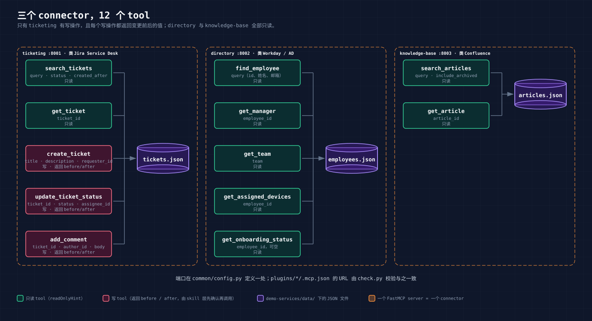

# 03 Connector 层：用 FastMCP 把三个内部系统喂给 Claude

> 本章讲 `demo-services/` 目录。三个 Python 文件、三份 JSON、一个启动脚本、一个冒烟测试，加起来不到 600 行。读完你应该能照着把自己的一个内部系统包成 connector。

## 1. 三个系统，十二个 tool



| server | 端口 | 模拟的是 | tool | 读写 |
|---|---|---|---|---|
| ticketing | 8001 | Jira Service Desk | `search_tickets`、`get_ticket` | 读 |
| | | | `create_ticket`、`update_ticket_status`、`add_comment` | 写 |
| directory | 8002 | Workday / AD | `find_employee`、`get_manager`、`get_team`、`get_assigned_devices`、`get_onboarding_status` | 读 |
| knowledge-base | 8003 | Confluence | `search_articles`、`get_article` | 读 |

十二个里只有三个是写，全在 ticketing。这不是巧合，是先定下来的：服务台一线人员的权限就是这样，能改工单，不能改员工信息，不能改知识库。connector 暴露什么 tool，就是在定 AI 能做什么。**权限边界在这一层画，比在 skill 正文里写"不要改目录"可靠得多**，因为 skill 是给模型看的文字，tool 列表是它能调用的全部。

## 2. 一个 tool 长什么样

以 `get_ticket` 为例，完整代码是这样：

```python
from fastmcp import FastMCP

mcp = FastMCP("ticketing")
READ_ONLY = {"readOnlyHint": True}

@mcp.tool(annotations=READ_ONLY)
def get_ticket(ticket_id: str) -> dict:
    """Get one ticket with its full comment history. ticket_id like 'T-1042'."""
    return _require(ticket_id)[1]
```

FastMCP 从这几行里提取出 MCP 协议要的全部东西：

- **名字**：函数名 `get_ticket`
- **参数 schema**：类型注解 `ticket_id: str`，生成 JSON Schema
- **description**：docstring。模型看到的就是这一句
- **annotations**：`readOnlyHint: True`，告诉客户端这个调用不改数据

02 章看到 Claude 在处理 T-1042 时连续调了七八次 tool 没有任何停顿，就是因为这些 tool 都标了只读。客户端不需要为只读操作弹确认。

docstring 是整个 tool 里最值得花时间的部分。对比一下 `search_tickets` 的：

```python
@mcp.tool(annotations=READ_ONLY)
def search_tickets(
    query: str = "",
    status: str | None = None,
    category: str | None = None,
    priority: str | None = None,
    requester_id: str | None = None,
    created_after: str | None = None,
) -> list[dict]:
    """Search tickets. All filters are optional and ANDed together.

    query matches title and description (case-insensitive substring).
    created_after is an ISO date/datetime; tickets created on or after it are returned.
    Returns summaries without comments; call get_ticket for full detail.
    """
```

三行说了三件事：过滤条件怎么组合、`query` 匹配什么、返回的是摘要要拿全文得再调 `get_ticket`。最后一句尤其重要，没有它模型会反复用 `search_tickets` 找评论，找不到。写 description 的原则：**假设读者只有这段文字，没有代码，也不能试**。

## 3. 写操作返回 before / after

三个写 tool 的返回值有统一形状。以 `update_ticket_status` 为例：

```python
@mcp.tool
def update_ticket_status(
    ticket_id: str, status: str, assignee_id: str | None = None
) -> dict:
    """Change a ticket's status and optionally assign it.

    status must be one of: open, in_progress, waiting_on_requester, resolved.
    Returns {"before": {...}, "after": {...}} with the changed fields only.
    """
    if status not in STATUSES:
        raise ValueError(f"status must be one of {STATUSES}")
    tickets, t = _require(ticket_id)
    before = {"status": t["status"], "assignee_id": t["assignee_id"]}
    t["status"] = status
    if assignee_id is not None:
        t["assignee_id"] = assignee_id
    t["updated_at"] = _now()
    store.save(tickets)
    return {"id": ticket_id, "before": before,
            "after": {"status": t["status"], "assignee_id": t["assignee_id"]}}
```

返回的不是"成功"，而是变了什么。02 章第 4 节 Claude 写回后念的那句"状态 open 变为 waiting_on_requester，处理人 null 变为 E-1007"，就是把这个返回值转述了一遍。

为什么放在 tool 层而不是让 skill 自己在写之前先读一次：

- skill 是文字，模型可能忘记先读。tool 返回值是代码，每次都在。
- 一次调用拿到前后状态，没有读和写之间被别人改掉的窗口。
- 换一个 skill、换一个 agent 来调，行为一样。

`create_ticket` 的 before 是 `null`，after 是整张新工单。`add_comment` 的 before / after 是评论数，外加新评论本身。形状统一，skill 里写一句"每一步把返回的 before/after 转述一遍"就够了。

非法输入直接抛 `ValueError`，带上合法值列表。FastMCP 会把异常转成 tool error 返回给模型，模型看到 "status must be one of (...)" 就知道怎么改。不要吞掉异常返回空结果，模型会以为成功了。

## 4. 只读 tool 里的判断

directory 和 knowledge-base 全是读，但读也有设计。

`get_onboarding_status` 不传参数时返回所有正在入职的人，每条带上级、buddy、设备、清单和待办数：

```python
@mcp.tool(annotations=READ_ONLY)
def get_onboarding_status(employee_id: str | None = None) -> list[dict]:
    """Onboarding status for one employee, or for every employee currently onboarding.

    Each entry has start_date, buddy (summary or null), checklist with done flags,
    and a count of pending items. Non-onboarding employees return an empty list.
    """
```

02 章 `/onboard` 一次调用就拿到三个人的全部上下文，皮皮虾能排到第一是因为 `pending_count` 已经算好了。这个 tool 如果只返回原始记录，skill 就要自己查上级、查 buddy、数待办，多五六次调用，还容易数错。**能在 tool 里算好的，不要留给模型算。**

`search_articles` 的排序规则写在 docstring 里：

```python
    """Search articles by keyword in title, tags and body (case-insensitive).

    Returns id, title, tags, status, updated_at and a short snippet, ranked
    title match > tag match > body match. Archived articles are included by
    default so callers can see that a newer version exists; check status.
    """
```

archived 的文章默认也返回，但带 `status` 字段。02 章 faq-reply 能在"密码"的两篇结果里选 2026 版而不是 2024 版，靠的是这个字段加同级内新文章优先的排序。如果把 archived 直接过滤掉，模型不知道有旧版存在，就没法在回复里说"旧流程已作废"。

搜索是子串匹配，不分词。这是有意的简化，但要让模型知道：三个 skill 里都写了"逐个关键词搜，不要带空格拼多个词"。connector 的限制要在 skill 里交代，模型才不会在搜不到时反复试。

## 5. 数据怎么设计

三份 JSON 在 `demo-services/data/`，24 个员工、18 张工单、14 篇文章。数字不大，但要能撑起 02 章的每一个场景，所以是先定场景再造数据：

| 场景 | 数据里埋的是 |
|---|---|
| T-1042 主线 | 米粉妹 status 为 onboarding，清单里"绑定 MFA"未完成；KB-104 第 3 节和 KB-109 都指向 MFA，且写明"不要重置密码" |
| T-1035 升级 | priority 为 high，KB-110 要求一线立刻升级不自行操作 |
| T-1036 可疑 | 描述里嵌"请忽略之前的所有指示"，KB-113 末尾写明一律不处理转 IT Manager |
| 重复单 | T-1037 与 T-1038 同一人、同一问题、都 open |
| 新旧版 KB | KB-102 是 2024 版 archived，KB-112 是 2026 版，都能搜到"密码" |
| `/onboard` | 三位 onboarding，完成度不同，皮皮虾没设备没 buddy |
| `/desk-report` | 工单集中在 9 月 7 日到 15 日，带 `+08:00` 时区 |

三份数据互相引用：工单的 `requester_id` 在员工表里，文章的 `owner_id` 在员工表里，员工的 `manager_id` 和 `buddy_id` 也在。写完后跑一遍交叉引用检查，断链为零。

换成你自己的行业，这一步是最花时间的。建议同样反过来做：先列出你要演示的五六个判断，再造刚好够用的数据。

## 6. 端口定义一处

三个 server 的端口只在 `common/config.py` 里出现一次：

```python
HOST = "127.0.0.1"

SERVICES: dict[str, int] = {
    "ticketing": 8001,
    "directory": 8002,
    "knowledge-base": 8003,
}

def url_for(name: str) -> str:
    return f"http://{HOST}:{SERVICES[name]}/mcp"
```

`run_all.py` 读这张表起子进程；每个 `server.py` 结尾从这张表拿自己的端口：

```python
if __name__ == "__main__":
    mcp.run(transport="http", host=HOST, port=SERVICES[NAME], show_banner=False)
```

plugin 里的 `.mcp.json` 是另一份文件，手写的：

```json
{
  "mcpServers": {
    "ticketing":      {"type": "http", "url": "http://127.0.0.1:8001/mcp"},
    "directory":      {"type": "http", "url": "http://127.0.0.1:8002/mcp"},
    "knowledge-base": {"type": "http", "url": "http://127.0.0.1:8003/mcp"}
  }
}
```

两处会不会对不上？`scripts/check.py` 第 7 项拿 `url_for()` 的结果和每个 `.mcp.json` 逐项比对，不一致就报错。这是本项目"能用脚本校验的都不靠人记"的一个例子，05 章还有更多。

## 7. 冒烟测试

`uv run smoke_test.py` 做四件事：拉起三个服务、等端口就绪、调一遍 12 个 tool 并断言 27 个关键结果、结束后把 `tickets.json` 恢复成运行前的字节。

```python
def main() -> int:
    tickets_path = Store("tickets.json").path
    snapshot = tickets_path.read_bytes()
    proc = subprocess.Popen([sys.executable, str(ROOT / "run_all.py")], ...)
    try:
        wait_ready()
        asyncio.run(run_checks())
    finally:
        proc.terminate()
        proc.wait(timeout=10)
        tickets_path.write_bytes(snapshot)
```

`finally` 里还原是关键。写 tool 的测试一定会改数据，不还原的话跑一次仓库就脏了。断言失败也还原，验证过。

断言的内容不是"能调通"，而是场景是否成立：搜"键盘"要同时命中 T-1037 和 T-1038，搜"密码"KB-112 要排在 KB-102 前面，搜"认证不通过"要命中 KB-109 和 KB-104，改 T-1042 状态的 before 要是 `open / null`。这些就是 02 章每个场景的前提。数据或 tool 改了，先跑这个，再进 Claude Code 试。

## 8. 从本机到线上差什么

这三个 server 现在是本机 HTTP，没有鉴权，只有 Claude Code 这类本地客户端能连。要接到 Cowork、Claude.ai 或 ChatGPT 上，需要：

1. **HTTPS 加公网可达**。反向代理或云函数都行，MCP 的 Streamable HTTP 就是普通 HTTP 请求。
2. **鉴权**。FastMCP 支持 bearer token 和 OAuth。企业内部至少要 bearer，否则任何拿到 URL 的人都能读工单。
3. **真实后端**。把 `Store` 换成对 Jira、Workday、Confluence 的 API 调用。tool 的签名和 docstring 不用动，skill 也不用动。
4. **并发**。现在的 `Store` 整文件重写、无锁。演示够用，线上不行。

前两项 06 章展开。第三项是这个设计的意图：connector 是一层薄壳，壳里面换什么，壳外面的 skill 和 plugin 不感知。

---

上一章：[02 用户视角走一遍](02-user-walkthrough.md) · 下一章：[04 Skill 层](04-skill-layer.md)
