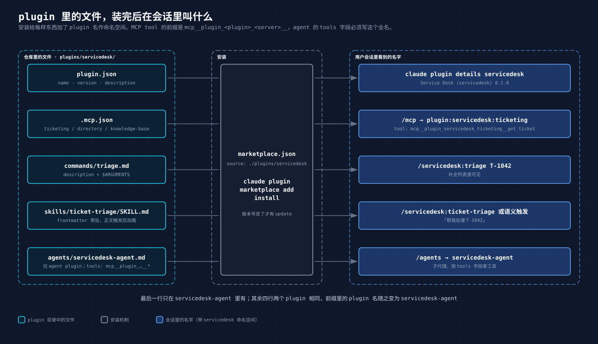

# 05 Plugin 层：plugin.json、marketplace、版本更新，agent plugin 与 vertical plugin 的区别

> 本章讲 `plugins/*/.claude-plugin/`、根目录的 `.claude-plugin/marketplace.json`、`plugins/servicedesk-agent/agents/`，以及 `scripts/` 下两个脚本。这一层没有业务逻辑，全是打包、命名、校验。但 02 章用户两条命令就装好的体验，全靠这一层。

## 1. plugin 解决什么

03 章的 connector 和 04 章的 skill 写完之后，东西是这样散着的：三个 server 地址、四份 SKILL.md 加它们的 references、三个 command。要交给一个同事用，他得手工建 `.mcp.json`、把 skill 目录复制到自己的 `~/.claude/skills/`、再把 command 放对位置。改了一处，所有人重来一遍。

plugin 把这些打成一个目录，加一份清单，装的人一条命令，更新的人一条命令。它做的事和 npm、pip 没有区别，只是包里装的是 Markdown 和 JSON。

## 2. 两份清单

**`plugins/servicedesk/.claude-plugin/plugin.json`** 描述一个 plugin：

```json
{
  "name": "servicedesk",
  "displayName": "Service Desk",
  "version": "0.1.0",
  "description": "IT / HR 内部服务台工作流：接入工单、员工目录、知识库三个系统……",
  "author": { "name": "guige" }
}
```

没有列出包含哪些文件。Claude Code 按约定目录找：`.mcp.json`、`commands/*.md`、`skills/*/SKILL.md`、`agents/*.md`，有就装。

**根目录 `.claude-plugin/marketplace.json`** 描述一个可安装源：

```json
{
  "name": "guige-servicedesk",
  "owner": { "name": "guige" },
  "description": "Connector + Skill + Plugin 教程示例……",
  "plugins": [
    { "name": "servicedesk", "source": "./plugins/servicedesk", "description": "…" },
    { "name": "servicedesk-agent", "source": "./plugins/servicedesk-agent", "description": "…" }
  ]
}
```

`source` 是相对路径，所以这个仓库克隆到任何位置都能当 marketplace 用。02 章 `claude plugin marketplace add /path/to/repo` 读的就是这份文件，`install servicedesk@guige-servicedesk` 里 `@` 后面是这里的 `name`。

两份清单都能用 `claude plugin validate <path>` 校验。第一次校验时 marketplace 缺 description 报了警告，补上就过。写完清单先跑这个，再跑本项目的 `check.py`。

## 3. 安装后发生了什么



安装的本质是给每样东西加上 plugin 名作命名空间：

| 仓库里 | 会话里 |
|---|---|
| `.mcp.json` 里的 `ticketing` | `/mcp` 显示 `plugin:servicedesk:ticketing`；tool 全名 `mcp__plugin_servicedesk_ticketing__get_ticket` |
| `commands/triage.md` | `/servicedesk:triage` |
| `skills/ticket-triage/SKILL.md` | `/servicedesk:ticket-triage`，同时可被语义触发 |
| `agents/servicedesk-agent.md` | `/agents` 列表里的 `servicedesk-agent` |

命名空间的作用是避免冲突：两个 plugin 都有叫 `triage` 的 command 也不会打架。代价是有一处必须写全名，第 6 节讲。

skill 正文里的 tool 名仍然是裸名 `get_ticket`。Claude 看到的 tool 全名带前缀，但它能对上，因为前缀之后就是裸名。这是 04 章说"skill 不该知道前缀"能成立的原因。

## 4. 版本号驱动更新

`plugin.json` 里的 `version` 是给用户的信号。改了 skill 之后：

1. 改 `version`，比如 `0.1.0` 到 `0.1.1`
2. 提交、推送
3. 用户跑 `claude plugin marketplace update guige-servicedesk` 刷新清单，再 `claude plugin update servicedesk`，重启 Claude Code 生效

开发期间不用走这一套。`claude --plugin-dir plugins/servicedesk` 直接从目录加载，改完 Markdown 重开会话就是新的。00 章的开发循环一节写了这个。

一个容易踩的点：装的是副本。`claude plugin install` 把目录复制到 Claude Code 的缓存里，之后你改仓库里的文件，会话里用的还是旧的。02 章之后我改了 agent 的 tools 字段，测试会话里没生效，就是这个原因。要么 `update`，要么用 `--plugin-dir`。

## 5. 两种 plugin

本仓库有两个 plugin，内容几乎一样，交付形态不同。README 有一张对照表，这里展开。

**servicedesk（vertical plugin）** 是一盒能力。装上后多了 3 个 command、4 个 skill、3 个 MCP 连接。谁来决定用哪个 skill？用户当前的 Claude 会话，靠每份 SKILL.md 的 description。skill 之间互不知道彼此存在，跨 skill 的规则在每份里各写一遍。

**servicedesk-agent（agent plugin）** 在上面的基础上多一个文件 `agents/servicedesk-agent.md`。它是一份完整的 system prompt：

```yaml
---
name: servicedesk-agent
description: IT / HR 服务台一线支持的 AI 搭档。给一个工单号、一位新员工、一个员工问题或一个时间段，……
tools: mcp__plugin_servicedesk-agent_ticketing__*, mcp__plugin_servicedesk-agent_directory__*, mcp__plugin_servicedesk-agent_knowledge-base__*
---
```

正文写角色、能拿到什么工具、按请求形态路由到哪个 skill、停顿点、不做的事。四个 skill 变成这个角色的手册，由 prompt 统一调度。用户跟一个"服务台同事"对话，不需要知道 skill 是什么。

agent plugin 里的 skill 是从 vertical plugin 复制过来的副本，不是引用。这是 Claude Code plugin 的结构决定的：一个 plugin 的 skill 必须在它自己的目录里。第 7 节讲怎么管两份副本。

选哪个：

- 用户本来就在 Claude Code 里干活，顺手用一下服务台能力，或者想自己组合流程，装 vertical。
- 要把服务台能力作为一个独立角色交付给不熟悉 Claude Code 的人，或者准备接 Managed Agent，装 agent。agent.md 的写法保持可被 `agent.yaml` 引用，本期没做这一步。

两个不要同时装。同一会话里会有两份同名 skill，触发时不确定读哪份。

这个分法来自 financial-services 仓库：`vertical-plugins/` 按行业给能力，`agent-plugins/` 把能力组装成端到端的 agent。本项目保留两套是为了把区别讲清楚，服务台场景本身不非得两套。

## 6. 一个真实的坑：agent 的 tools 前缀

第一版 agent.md 的 frontmatter 是照 financial-services 里 `tools: mcp__capiq__*` 的写法抄的：

```yaml
tools: mcp__ticketing__*, mcp__directory__*, mcp__knowledge-base__*
```

装上后让它处理 T-1042，子代理拒绝启动，原因是零工具。三个通配一个都没匹配上。

原因是第 3 节讲的命名空间。plugin 装上后 MCP server 被登记为 `plugin_servicedesk-agent_ticketing`，tool 全名是 `mcp__plugin_servicedesk-agent_ticketing__get_ticket`。`mcp__ticketing__*` 匹配的是没有 plugin 前缀的 server，那是用户自己在 `.mcp.json` 里配的情形，不是 plugin 带来的。

修法一行：

```yaml
tools: mcp__plugin_servicedesk-agent_ticketing__*, mcp__plugin_servicedesk-agent_directory__*, mcp__plugin_servicedesk-agent_knowledge-base__*
```

这个坑说明两件事。一是 skill 和 agent 对前缀的要求相反：skill 正文写裸名，agent frontmatter 写全名，因为 skill 是给模型读的文字，agent 的 tools 是给客户端做权限过滤的模式。二是照模板抄运行时相关的配置之前，先起一次真实环境看名字。

修完之后往 `check.py` 加了第 8 项：agent frontmatter 里以 `mcp__` 开头的 tools 必须符合 `mcp__plugin_<本plugin名>_<server>__` 格式，且 `<server>` 要在该 plugin 的 `.mcp.json` 里声明。改回旧写法会报 3 条错误，故意写错 server 名也能抓到。

## 7. 两份副本怎么管

skill 只在 `plugins/servicedesk/skills/` 编辑。agent plugin 里的副本由脚本生成。

**`scripts/sync-agent-skills.py`** 扫 `plugins/*`，有 `agents/` 目录的算 agent plugin，其余算 vertical。把每个 agent plugin 已有的 skill 目录，从 vertical 中同名源整目录覆盖。不带参数只刷新已有的；`--all` 把所有 vertical skill 都捆进去，第一次用。

脚本里没有 `servicedesk` 这个词。换行业时 plugin 改名，脚本不用动。

**`scripts/check.py`** 八类检查：

| # | 检查 | 拦的是什么 |
|---|---|---|
| 1 | marketplace.json 和每个 plugin.json 能解析 | 手改 JSON 少个逗号 |
| 2 | marketplace 的 source 指向有 plugin.json 的目录 | 改了目录名忘了改清单 |
| 3 | agent.md 有 name 和 description | frontmatter 漏字段 |
| 4 | SKILL.md 有 name 和 description，name 等于目录名 | 复制 skill 忘改 name |
| 5 | agent plugin 的 skill 副本与 vertical 源字节一致 | 改了源忘了 sync，或直接改了副本 |
| 6 | agent 正文里反引号包着的 skill 名都已捆绑 | prompt 提到的 skill 不在包里 |
| 7 | 每个 `.mcp.json` 的 URL 与 `demo-services/common/config.py` 一致 | 改了端口漏一处 |
| 8 | agent tools 用 `mcp__plugin_<plugin>_<server>__` 前缀且 server 已声明 | 第 6 节的坑 |

第 5 项试过：手动往副本里加一行，check 报 drift 并提示跑 sync；sync 后恢复通过。

这两个脚本从 financial-services 精简而来，去掉了 managed-agent 的 YAML 检查、PowerShell 编码检查、git hooks 安装，加了第 4、7、8 项。

## 8. 一次发布的流程

改一条分诊规则，从编辑到用户拿到：

```bash
# 1. 改源
vim plugins/servicedesk/skills/ticket-triage/references/triage-rules.md

# 2. 同步到 agent plugin
python3 scripts/sync-agent-skills.py

# 3. 校验
python3 scripts/check.py
claude plugin validate .

# 4. 升版本号（两个 plugin.json 都改，如果两边都受影响）
# 5. 提交、推送

# 6. 用户侧
claude plugin marketplace update guige-servicedesk
claude plugin update servicedesk
```

第 2、3 步没做，第 3 步会在第 5 项上报错，所以实际上漏不掉。

这个流程里没有任何一步需要打开 Claude Code 试。skill 的正确性靠 03 章的 `smoke_test.py`（connector 层）和这里的 `check.py`（结构层）兜底，实跑留给行为验证。

---

上一章：[04 Skill 层](04-skill-layer.md) · 下一章：[06 产品化检查清单](06-productization-checklist.md)
